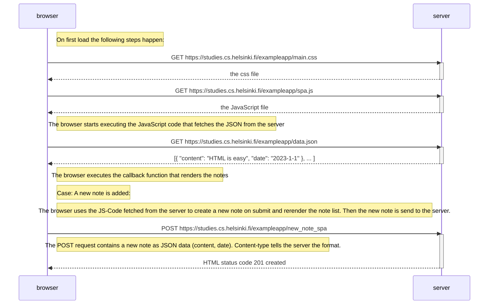

```mermaid
  sequenceDiagram
    participant browser
    participant server
    
    Note right of browser: On first load the following steps happen:
    
    browser->>server: GET https://studies.cs.helsinki.fi/exampleapp/main.css
    activate server
    server-->>browser: the css file
    deactivate server

    browser->>server: GET https://studies.cs.helsinki.fi/exampleapp/spa.js
    activate server
    server-->>browser: the JavaScript file
    deactivate server

    Note right of browser: The browser starts executing the JavaScript code that fetches the JSON from the server

    browser->>server: GET https://studies.cs.helsinki.fi/exampleapp/data.json
    activate server
    server-->>browser: [{ "content": "HTML is easy", "date": "2023-1-1" }, ... ]
    deactivate server

    Note right of browser: The browser executes the callback function that renders the notes
    Note right of browser: Case: A new note is added:
    Note right of browser: The browser uses the JS-Code fetched from the server to create a new note on submit and rerender the note list. Then the new note is send to the server.

    browser->>server: POST https://studies.cs.helsinki.fi/exampleapp/new_note_spa
    activate server
    
    Note right of browser: The POST request contains a new note as JSON data (content, date). Content-type tells the server the format.

    server-->>browser: HTML status code 201 created
    deactivate server
    
```