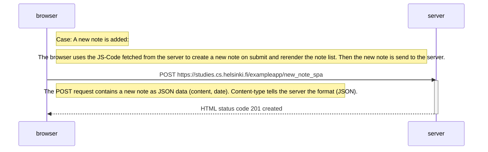

```mermaid
  sequenceDiagram
    participant browser
    participant server
    
    Note right of browser: Case: A new note is added:
    Note right of browser: The browser uses the JS-Code fetched from the server to create a new note on submit and rerender the note list. Then the new note is send to the server.

    browser->>server: POST https://studies.cs.helsinki.fi/exampleapp/new_note_spa
    activate server
    
    Note right of browser: The POST request contains a new note as JSON data (content, date). Content-type tells the server the format (JSON).

    server-->>browser: HTML status code 201 created
    deactivate server
    
```